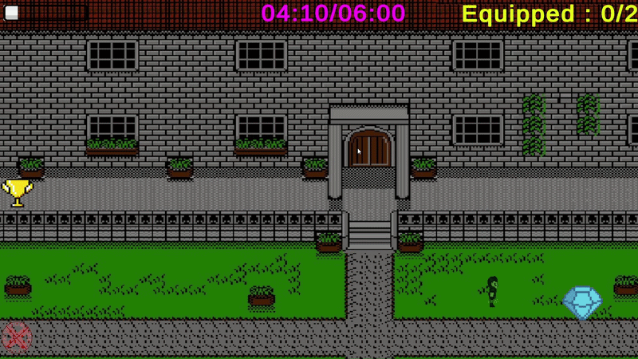

# Thiefy Thiefson 🥷💰

> **A 2D Stealth Speedrun Game created for Jamination 7.**

Thiefy Thiefson is a thrilling 2D stealth speedrun game where you play as a cunning thief trying to loot houses without getting caught. Heavily inspired by the iconic "Home Invasion" burglary mission from **GTA: San Andreas**, this game challenges you to manage your noise levels, race against the clock in a speedrun format, and grab as many treasures as you can before sunrise!

---

---

## 🎮 Gameplay & Mechanics

In Thiefy Thiefson, your biggest enemy is the sound of your own footsteps. You must navigate through three increasingly challenging houses, steal treasures, and deliver them to the safe zones.

- **Stealth and Sound (`FootSound`)**: Every step you take generates noise. Walking normally increases your sound meter quickly. Holding `Shift` allows you to sneak, generating less noise. Standing still helps you quiet down. If you make too much noise, it's game over!
- **Inventory Management**: You can only carry a maximum of **2 treasures** at a time. You must carefully plan your routes to grab treasures and deposit them in the safe "Zone".
- **Time Attack**: You only have until 06:00 AM to complete your heist. Time is ticking!
- **Rewards**: Pick up special reward items to instantly reduce your sound meter and save yourself from getting caught.

## 🕹️ Controls

| Action | Key / Input |
| :--- | :--- |
| **Move** | `W`, `A`, `S`, `D` / Arrow Keys |
| **Sneak (Reduce Noise)** | Hold `Left Shift` while moving |
| **Interact / Equip / Sell** | `Left Click` / `Right Click` / `Space` |
| **Restart Level** | `R` |

## 🛠️ Technical Details

This project was developed during the **Jamination 7** game jam within a very tight deadline. It represents my early steps into game development using Unity.

- **Engine:** Unity (2D)
- **Language:** C#
- **Core Scripts:** 
  - `GameManager.cs`: Handles global state, time limits (06:00 AM deadline), and UI updates.
  - `PlayerController.cs`: Manages physics-based movement, sound tracking, object collection, and scene transitions (House 1 -> House 2 -> House 3).
  - `Treasure.cs`: A procedural spawner that places treasures randomly within level boundaries while avoiding collisions with walls.

*(Developer Note: The codebase reflects the fast-paced nature of game jams, heavily relying on Singletons and direct scene management for rapid prototyping.)*

---

<!-- 📸 BAŞKA BİR EKRAN GÖRÜNTÜSÜ VEYA LOGO EKLENEBİLİR -->

## License & Copyright

&copy; Ucmaz pc. All Rights Reserved.  
This project is proprietary and intended solely for educational and portfolio purposes. It is not licensed for commercial use, distribution, or modification without explicit permission.
